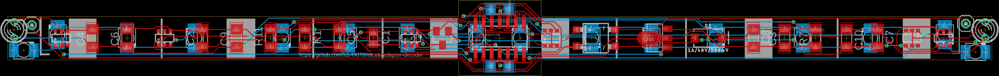
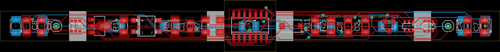

# Lokdecoder - Adapter Platinen und DIY Decoder - Spur N

Hier finden sich div. Adapterplatinen und vollständige DIY Lokdecoder auf Basis des (vermutlich eingestellten)
Projekts [Aegaeon](https://github.com/Railstars/Aegaeon) von [Railstars](http://railstars.com/).

Wie dieses Projekt auch, stehen die hier veröffentlichten Designs damit automatisch unter GPLv3.

Die Dekoder wurden leicht angeändert, und verwenden den Motortreiber
[BD623xx](http://rohmfs.rohm.com/en/products/databook/datasheet/ic/motor/dc/bd623x-e.pdf).

## Arnold

**1020/E94**

[NEM-651 Adapter](./loc-decoder/Arnold/1020/NEM-651_Adapter)

## Roco

**1044 alt, z.B. 23242**

[NEM-651 Adapter](./loc-decoder/Roco/1044/NEM-651_Adapter)

[Aegaeon Decoder mit BD62xx und Railcom](./loc-decoder/Roco/1044/Decoder-BD62xx-Railcom)

**BR215, z.B. 2150B**

[NEM-651 Adapter](./loc-decoder/Roco/BR215)

**BR 44, z.B. 2106B**

[NEM-651 Adapter](./loc-decoder/Roco/BR44)

## Minitrix

**E44**

[NEM-651 Adapter](./loc-decoder/Minitrix/E44/NEM-651_Adapter)

## Spectrum

**GE Dash 8-40CW**

[Aegaeon Decoder mit BD62xx und Railcom](./loc-decoder/Spectrum/GE_Dash_8-40CW-Railcom)

# Wagonbeleuchtung mit integriertem Decoder- Spur N

Mit freundlicher Erlaubnis von Hr. Brandt, verwende ich als Basis
für die Wagonbeleuchtung, seinen unter https://www.digital-bahn.de/bau_wald/wald_2v1.htm
veröffentlicheten Spur H0 - Waggon-Licht Dekoder (WaLD) V2.1
Sämtliche Lizenzen für diese Platinen und der darauf verwendeten Software liegen bei digital-bahn.

Diese Platinen werden von meiner Seite nicht zum Verkauf angeboten.
Der Verkauf und/oder Vertrieb eines hier veröffentlichten Designs darf nur unter
Rücksprache mit digital-bahn erfolgen. Copyleft.

Die Anleitung zur Installation der Software und die Schaltungsbeschreibung sind
in der oben genannten Seite zu finden.

Die originale H0-Platine und vorprogrammierte PIC-Controller können im Shop von
digital-bahn unter https://digital-bahn.de/shopping/Waggon-Beleuchtung bezogen werden.  

Folgende Modelle werden aktuell unterstützt:

[Roco - Eurofima z.B. 24270, 24285, uvm.](./wagon-light/Roco/Eurofima)

[Roco - Eilzugwagen / Schlierenwagen z.B. 24280-24281 ](./wagon-light/Roco/Eilzugwagen)

[Minitrix - Eurofima z.B. 3095, 3106, uvm.](./wagon-light/Minitrix/Eurofima)

Für kleinere Wägen gibt es allgemeine Platinen

[Einseite Montage - 50mm * 15mm](./wagon-light/common/50x15)

## Support und Fragen

Bei Fragen, Anregungen und Beschwerden, bitte einfach unter spur.n@stefanbauer.at melden.
